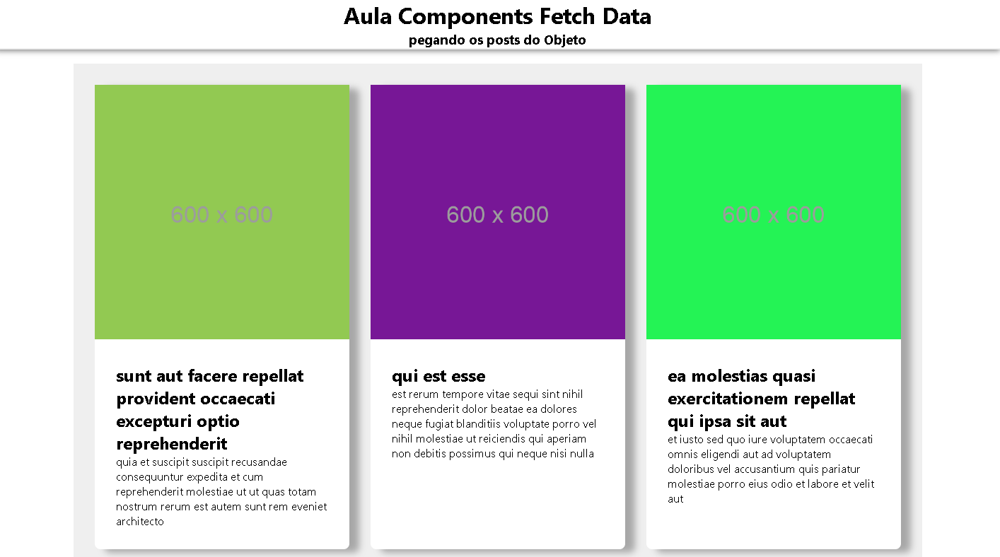

<h1 align="center"> React - Data Fetch </h1>

  a gente utiliza Fetch para buscar api como a seguir

<h3>

         componentDidMount(){
    fetch('https://jsonplaceholder.typicode.com/posts')
    .then(response => response.json())
    .then(posts => this.setState({posts}))
          }

</h3>

  maneira melhor de  fazer,criamos uma função onde consegue converte mais de uma api:

<h3>

       componentDidMount(){
    this.loadPost();
     }

       loadPost = async () => {
       const postsResponse =  fetch(
       'https://jsonplaceholder.typicode.com/posts'
     );

    const[posts] = await Promise.all([postsResponse]);

    const  postsJson = await posts.json();

    this.setState({ posts: postsJson})

         }

</h3>

 A gente utiliza essa maneira para pode pega os dados e fotos da api p/ renderizar 

<h3>

             loadPost = async () => {
             const postsResponse =  fetch(
              'https://jsonplaceholder.typicode.com/posts'
              );
            const photosResponse =  fetch(
              'https://jsonplaceholder.typicode.com/photos'
              );

              const[posts] = await Promise.all([postsResponse]);
              const[photos] = await Promise.all         ([photosResponse]);

              const  postsJson = await posts.json();
             const  photosJson = await photos.json();

              const postsAndPhotos = posts.json.map((post,index) => {
                return { ...post,cover: photosJson[index]}
              })
              this.setState({ posts: postsJson})

            }
 </h3>       

  <h2> Resultado
  

     
            
            
            
            
            
            
            
            
            
            
            
            
            
            
            