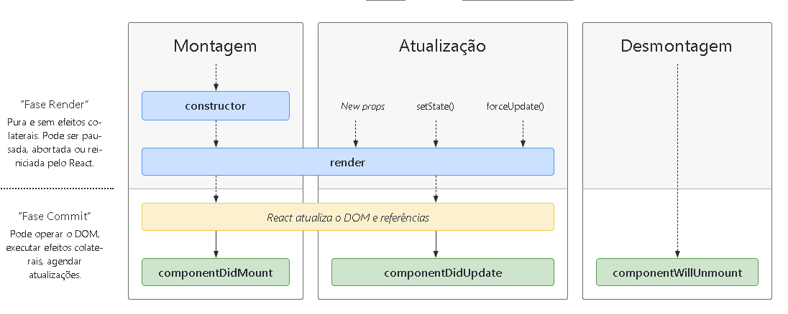
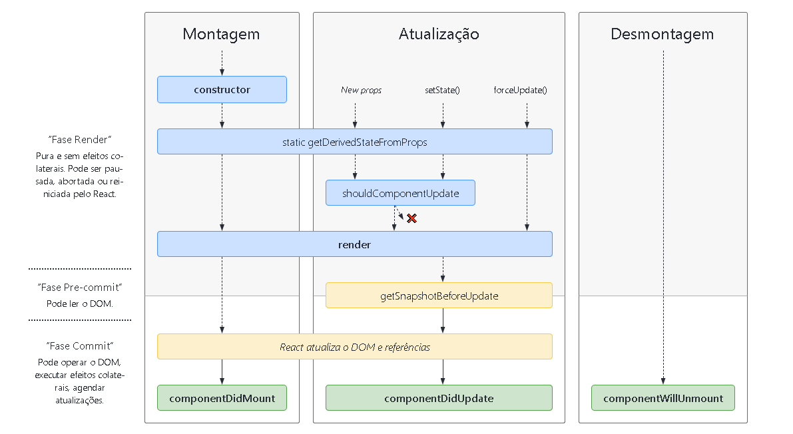

<h1 align="center"> React - Life Cycle  Part 2</h1>

<h2> Diagrama </h2>
<li style="font-size:18px;">Parte 1

 

<li style="font-size:18px;">Parte 2

 

<ul style="font-size:20px;">
<li> DidMount ->  Montagem 
<li> DidUpdate -> Atualizações
<li> WillUnmount  -> Desmontagem 