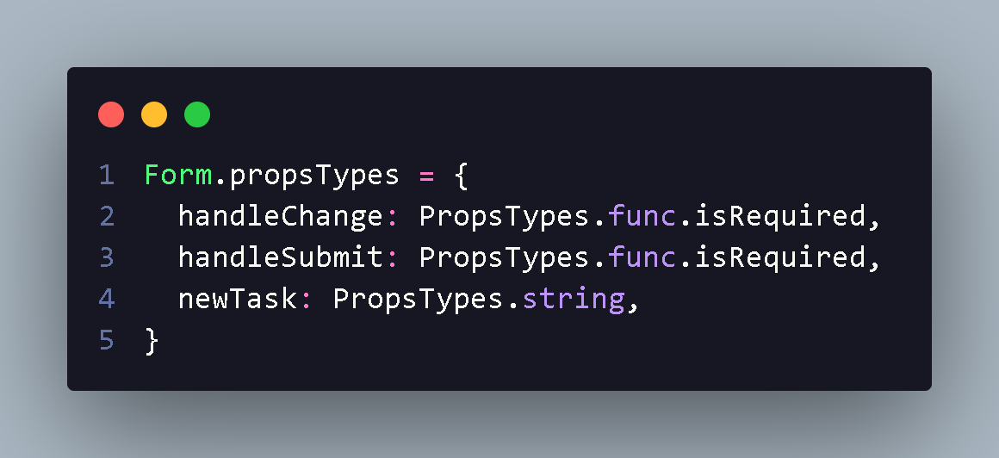

<h1 align="center"> Componentizar React </h1>

 Como utilizar padrão de organizção,react e uma  biblioteca como exemplo handle:

 <li style="font-size:18px">
 Props são coisas que passo meu conponents e tambem  preciso
  
 especificar oque e cada props para isso a gente instala as propstypes:

      npm i -D prop-types

      propstypes = { 

      }

<li style="font-size:18px"> Com isso a gente pega componentes e explicamos oque cada um props significa e se e requerido ou não

 <li style="font-size:18px">
 state são estado que podemos manipular e ser renderizado
 nos components

<h3> O que é componente ? </h3>

Simplimeste e uma class que contem render e retorna jsx/tsx ou componente de
 função jsx,podemos utilizar export com function ou const exemplo:

        export const PostCard = () => {

         return (
           

              
              

                <h1>{post.title}</h1>
               
 {post.body} 
 
               
 
           

          )
        }

 e ai onde entra props export const PostCard(Props){}
existe components  com filho que tem corpo e necessita abrir e fecha tag e como
exemplo acima não precisa entao utiliza uma tag la no App.js "< PostCard />"
dentro das tags fechadas podem conter atributos exemplo:

 < PostCard
   title={post.title}>
   body={post.body}>
   cover={post.cover}>
   ou
   post={post}
   < />

        para pegar post e simples utilizo 
        const post = props.posts

 padrão luiz miranda:
 

 <li style="font-size:18px;"> Pasta components:
 

 responsavel pelo componentedentro da pasta componentes eu adiciona arquivos jsx,tsx e tudo relacionado ao componetização

 <li style="font-size:18px;"> Se parar e organizar em pastas components e arq
 <li style="font-size:18px;"> Pasta Page e relacionado a pagina e rotas
