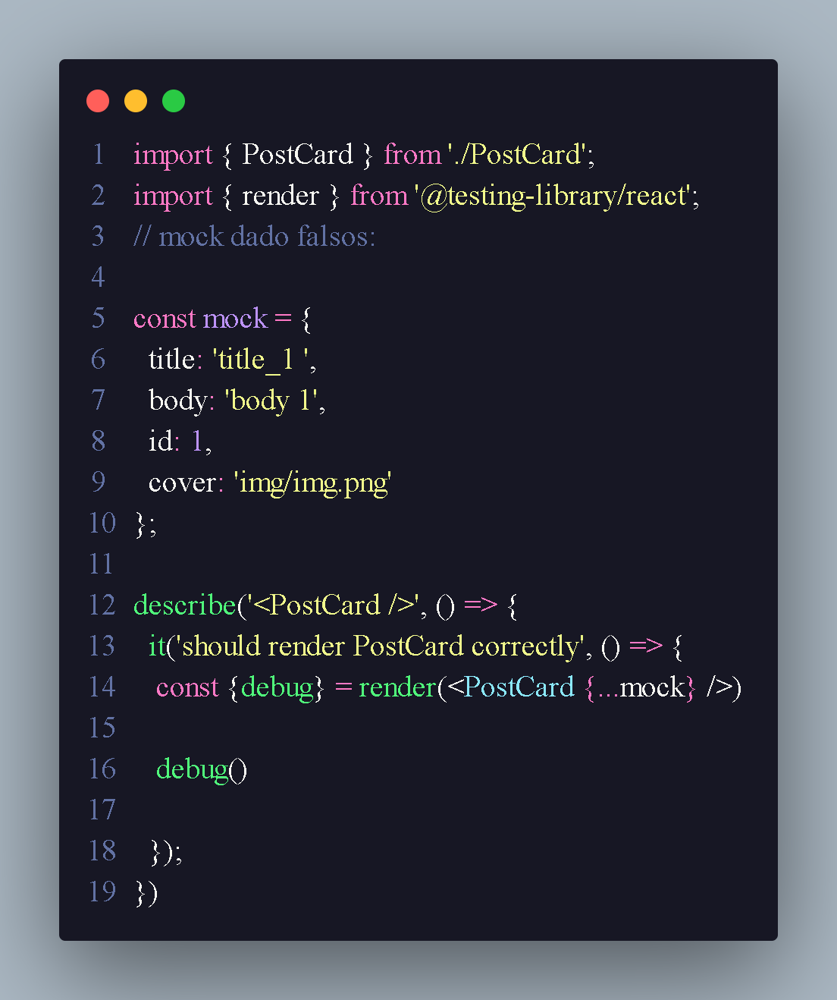

<h1 align="center"> teste unitario </h1>

 teste unitarios são teste de components 

 Podemos utilizar describe para descrever o que e teste e colocar varios teste dentro dele 
aonde utilizamos index.spec.jsx/tsx 

 teste de integração são teste de testes msm 

<h2>imports </h2>

<li> render -> ele e responsavel por renderizar </li>

 screen existe tem func 

<li>find ->
<li>get -> utilizamos para quando elemento estiver na tela,getAll e quando temos mais de um elemento
<li>query -> ele não levanta caso não encontre o elemento

 utilize expect(button).toBeInTheDocument()

 podemos tbm fazer teste assincronos 

<h2> function jest </h2>

 com jest podemos criar funções utilizando const fn = jest.fn();
na libary podemos disparar evento com fireEvent 

 podemos utilizar tbm useEvent 

 coverage ele vai ajuda a gente a mostra os lugares onde falta fazer teste 

<h2> Mock e jest </h2>

