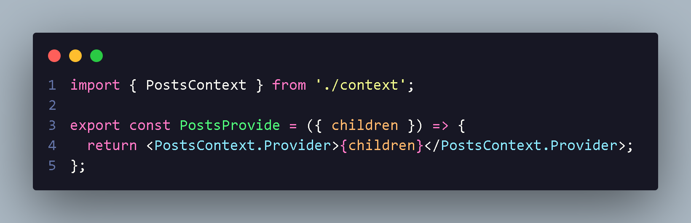

<h1 align="center"> Organização React useContext </h1>

<h2> Organização de Pasta context :</h2>

  

  

  Na pasta context fica os useContext que são utilizado globalmente onde utilizamos nome do hook mais Provide ! 

    <ul>
    <li> actions são responsavel por fazer uma ação,exemplo carregar os post;
    <li> types são os tipos das actions e onde defino para não erra um letra,numero ou chamar ela incorrenta;
    <li> data fica responsavel pela dados de entrada e saida;
    <li> context ficara create context;
    <li> reducer são responsavel pela actions e types;
    <li> PostProvider ou index sera onde ficara nosso componente;
  

     <h2> Action</h2>
           

           Com minha types definida a gente consegui
           import e utilizar dispatch que vem do reducer :
           

          <h3>Exemplo:</h3>
          
      <h2> Types </h2>
         

          A gente utiliza dessa maneira para
          exemplificar oque action vai realizar
          seja loading ou msg de success !
          

         <h3>Exemplo:</h3>
        
      <h2> Data </h2>
          

          data e onde fica responsavel por
          receber os dados e passar entradas
          das actions
          

          <h3>Exemplo:</h3>
         
     <h2> Reducer </h2>
          

           reducer
          

           <h3>Exemplo:</h3>
           
     <h2> Context </h2>
          
createContext  bem simples:

          <h3>Exemplo:</h3>
          
     <h2> PostsProvider nosso jsx </h2>
          

           Com nosso context criado e so import e criar nosso componente global PostsProvide para elemento da pagina;
          

           <h3>Exemplo:</h3>
           
           <h3>
           <em>Lembrando sempre de tipar com propsTypes: </em></h3>
           
Caso tenha mais de um elemento utilizamos node em vez de elment

           
           <h3>com isso basta adicionar nosso reducer junto com data para pode finalizar componente global !</h3>
           
           <h3>
            Logo apos e só colocar nosso componente context e encapsular na onde queremos !
           </h3>
           

