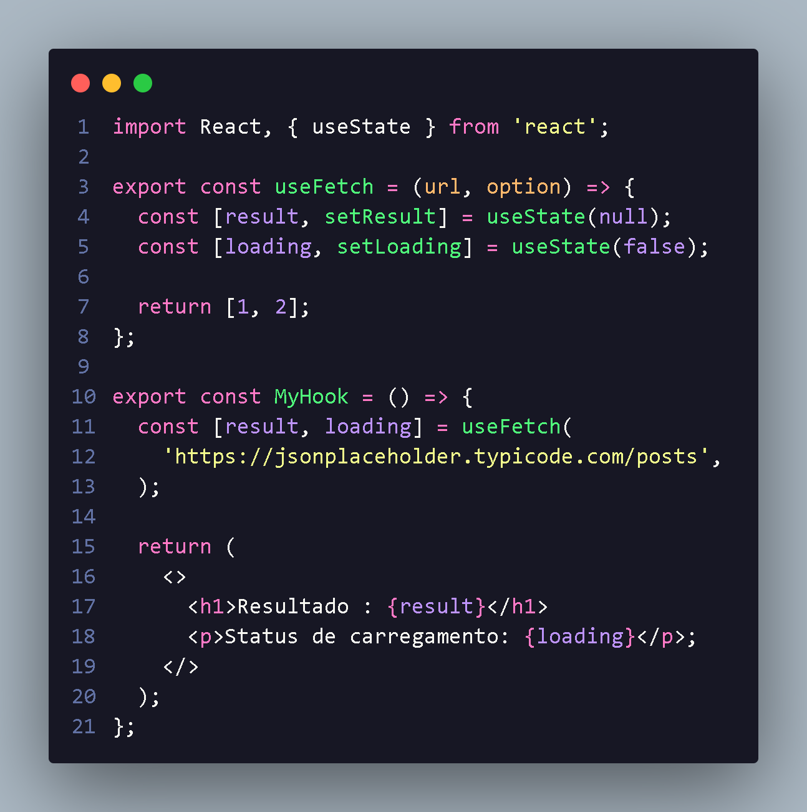

<h1 align="center"> UseFetch hook </h1>

  

    useFecth e hook custom para fazer um loadata onde vai
    carregar os dados e por ai vai,
     
    ela recebe 2 arg url e option sendo :
  

  <li> url - url de api,request info(Obj request)
  <li> option - ele e request init tbm um obj
  

  

