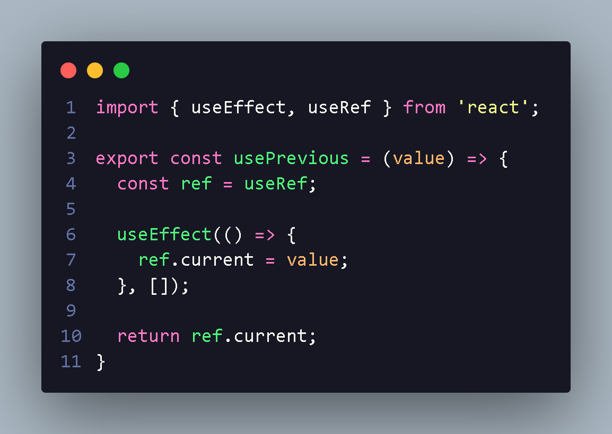

<h1 align="center"> Custom Hooks </h1>

OS custom hooks são so hooks que nós criamos,muitas vezes para abstrair fuções complexas do componente ou simplesmente reaproveitar codigo,
esta tecnica e muito utilizada em projetos profissionais !

