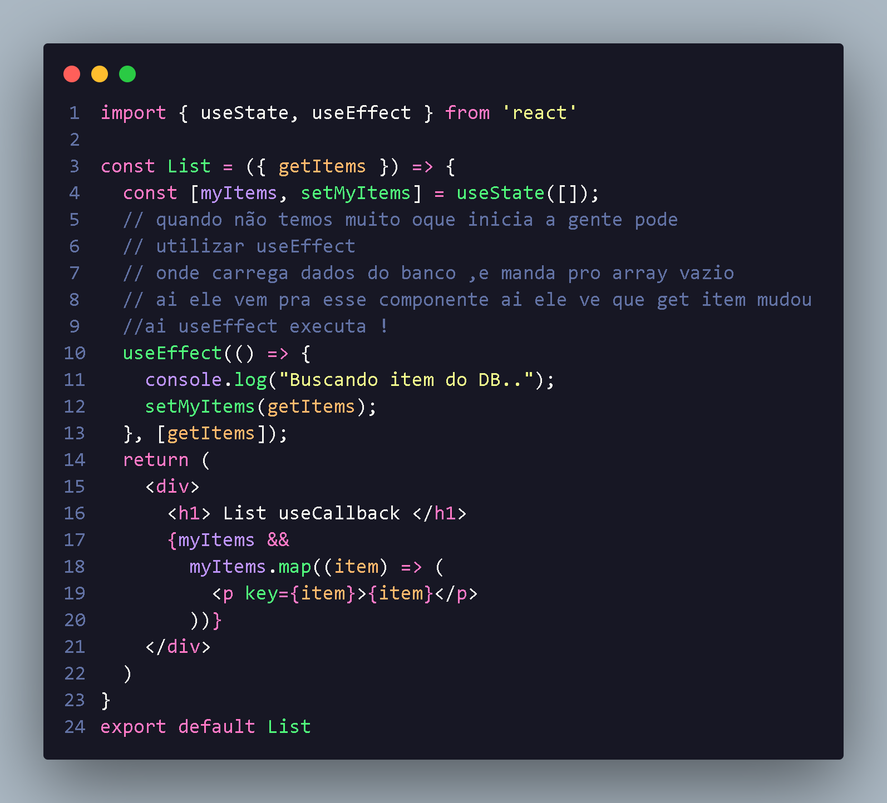

<h1 align="center"> introdução do CallBack </h2>

 
<b>O hook de useCallBack
pode ser utilizado para duas situações: </b>
<li style="font-size:16px;"> O primeiro caso e quando estamos prezando pela performace então quremos que uma função muito complexa não seja reecontruida toda vez
<li style="font-size:16px;"> ja segunda caso e quando  o proprio React nos indica que uma função deveria estar contida em um useCallback,para evitar problema de perfomace:

  <h3>A gente cria simulação com arq List </h3>

 Onde utilizaremos useState e useEffect para receber dados !

 

 

  Com isso podemos prosseguir :
 

    Como vemos abaixo pode substituir arrowfunction por useCallback e melhorar nossa perfomace
 

  

   com isso bastamos adicionar useCallback dentro do params passar a função para gerar mais performace,tambem podemos deixa um array de dependência!
  

  

   
  

  

  Com isso useCallback deixa memorizado a função para deixa mais facil e com performe melhor!
  

