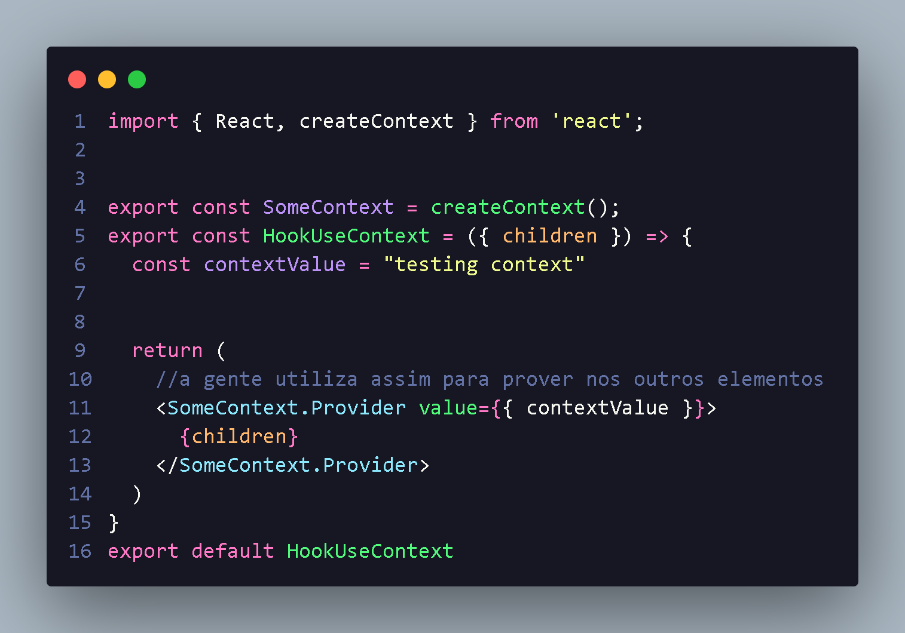
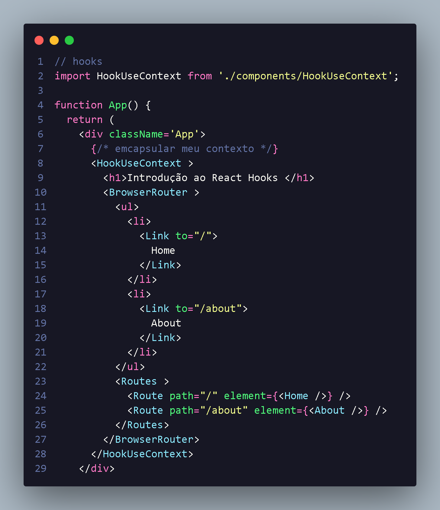
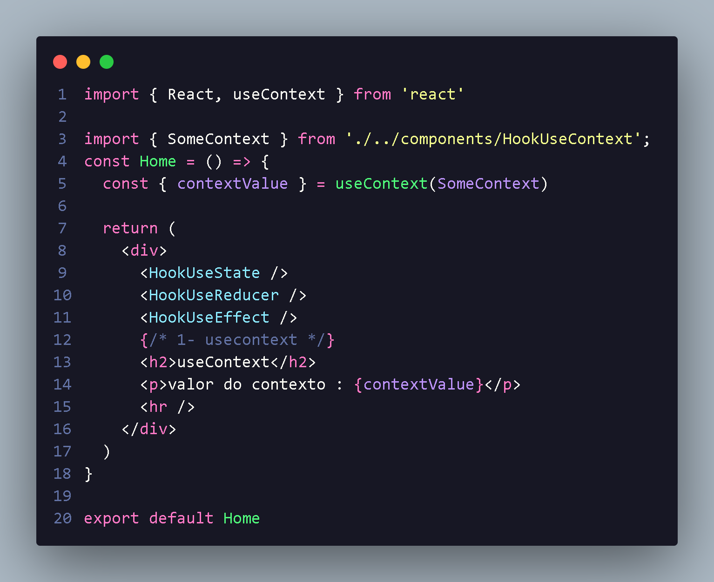

<h1 align="center"> introdução UseContext Reactjs </h1>

O useContext e o hook utilizado par aconsumir um contexto  API,e quando precisamos usar globalmente na aplicação :

<li  style="font-size:16px;">Vamos preciar criar o contexto e tambem o provider;
<li  style="font-size:16px;">Envolver os componentes que receberão os valores compartilhados:
<li  style="font-size:16px;">e entao fazer o uso do hook onde necessario:
<li  style="font-size:16px;">a gente vai utilizar createContext para definir nosso hook SomeContext
<li  style="font-size:16px;"> com isso vamos adicionar no HookUseContext= ({children}), oque vai ser focado que são elementos filho onde posso envolver direto com elementos
<li  style="font-size:16px;"> Depois criamos Provide onde vamos pode utiliza para promover entre elementos 

 

Dentro do arquivo de renderização utilizamos e emcapsulamos:

 
 Com isso podemos utilizar em pagina ou components
 <li  style="font-size:16px;"> A gente utiliza useContext para comsumir nosso hook SomeContext e com isso conseguimos pega valores dele aqui,utilizando hook para consumir os contexto gerado pela apis: 

