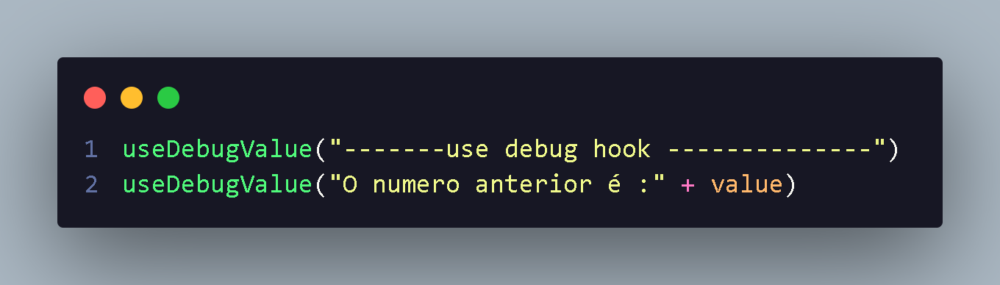

<h1  align="center"> UseDebugValue </h1>

  E um hook que utilizado para debug
  aconselhado para ser utilizado em custom hook,adiciona uma area no ReactDEvTool,ela estara no componente em que hook e utilizado;
    

