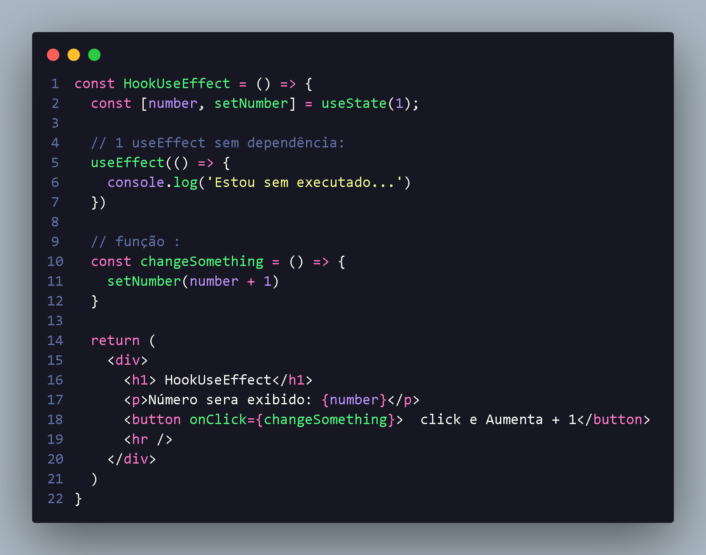
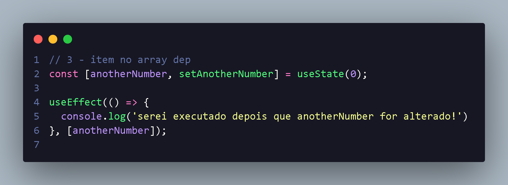

<h1 align="center"> Introdução sobre UseEffect </h1>

O<b> useEffect</b> é utilizado para várias ações no nosso App,junto com useState e um dos Hooks mais utilizado:

<li style="font-size:16px;"> Podemos realizar desde alterações na DOM a requisições HTTP;
<li style="font-size:16px;">E um dos grande motivo para conseguimos controlar quantas vezes algo acontece 
<li style="font-size:16px;"> A sintaxe e formada por uma função a ser executada e um array de dependências :

 

 

<li> Com isso ele sempre sera executado quando for renderizado, com useState a gente pode fazer ele ser rendizado mais vezes.

<h2 align="center"> useEffect Com array vaazio </h2>

Uma estratégia  interessante par algumas  situações e utilizar  useEffect apena uma vez!
<li style="font-size:16px;">Para isso utilizamos um array dependência vazio;
<li style="font-size:16px;"> <em> ao Renderizar o componente e a logíca será executada;
</em>

 

<h3> Utilizando array de dependência :</h3>

<li style="font-size:15px;">
  Outra maneira de controlar quando useEffect será executado e colocando algum item no array de dependências;
<li style="font-size:15px;">
  Assim sempre que o item for alterado ,teremos useEffect sendo executado novamente;
<li style="font-size:15px;">
  nos fornecendo um maior controle de quando uma 
  função deve ou não ser executada !

 

 
<li>Com isso  utilizando useState a gente consegue ter controle sobre useEffect :

 

<h2 align="center"> CleanUp useEffect </h2>

 <li> Alguns efeitos precisam ter uma técnica de cleanup(limpeza) para garantir o seu funcionamento;
 <li> não fazer isso pode gerar error de comportamento indesejados:
 <li> <b>Exemplos:</b> um timeout que ao mudar de página pode continuar a ser executado,pela falta de limpeza !

  
 

 

