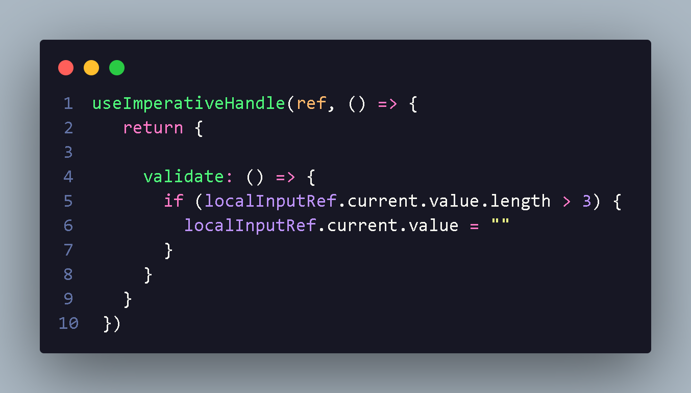
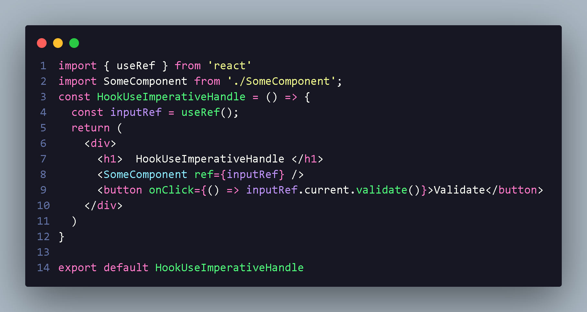
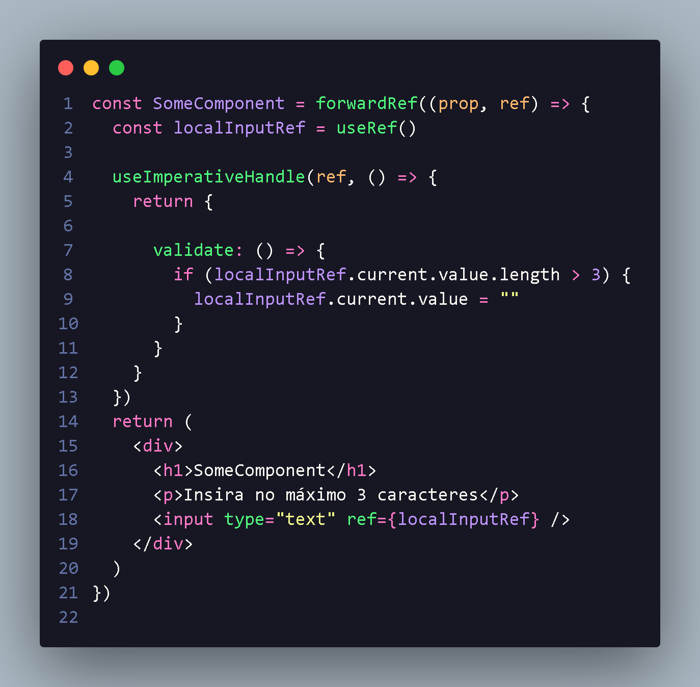

<h1 align="center"> useImperativeHandle introdução </h1>

    Com o hook useImperativeHandle temos como acionar ações em um outro componente de forma imperativa;
     
    Como não podemos passa refs como props,precisamo usar uma função fowardRef 
    isso vai nos permitir passa as referências,e torna o nosso exemplo viavel !

  

  

   Com forwardRef,nosso useImperativeHandle recebe ref
  

  <li style="font-size:18px;">
  A gente cria um componente onde vai ser referenciado propriedade com ref={inputRef} ,onde importamos ele
  </li>
   
  

  

  

  

      Com isso podemos ter acesso a  props e ref

  

  

    Com isso teremos tempo para execução no componente SomeComponet para  hook,utilizando current a gente consegui
    utilizar metodo passado dentro do useImperative aonde nosso hook passa para ref e valida ação
  

  

