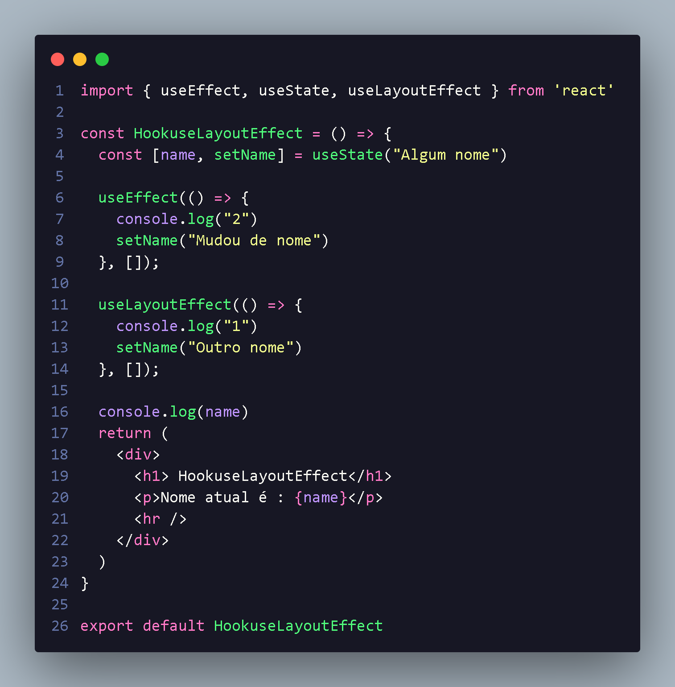

<h1 align="center">  introdução sobre useLayoutEffect </h1>

  Muito parecido com o useEffect,A grande diferença e que este hook roda antes de renderizar o componente,ou seja um hook é sincrono,bloqueando o carregamento da página para o sucesso da sua funcionalidade,a ideia e executar algo antes que o úsuario veja a página !

 

  quando queremos  executar algo antes de ser renderizado utilizamos useLayoutEffect !

