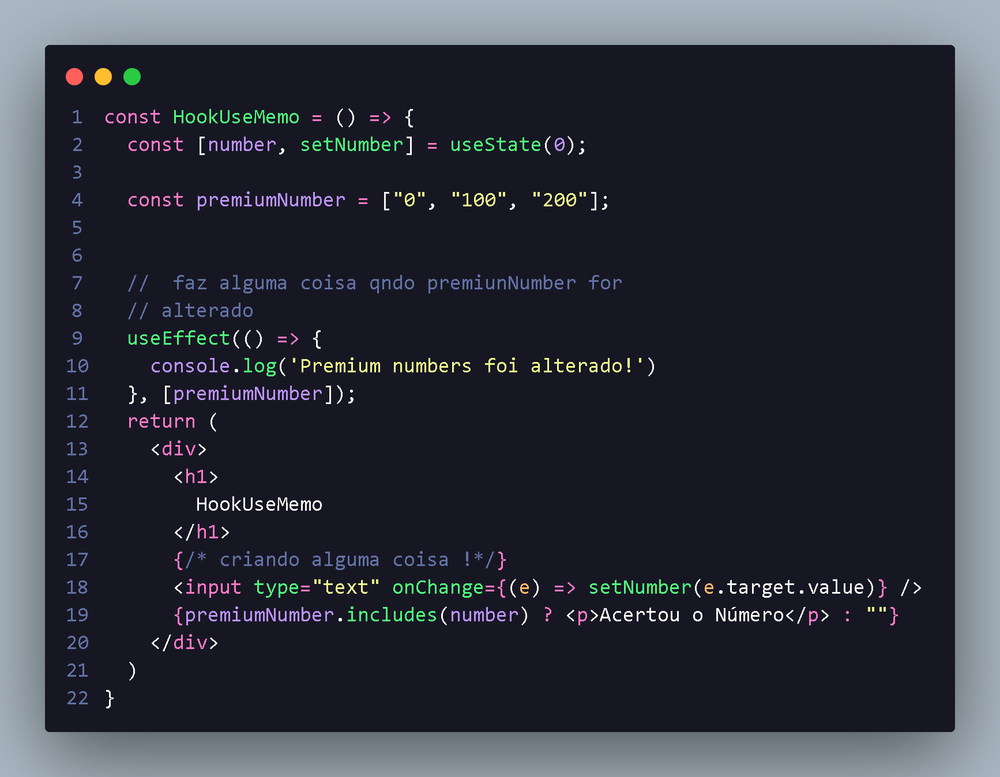
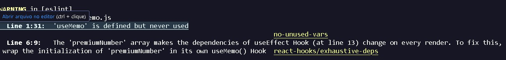
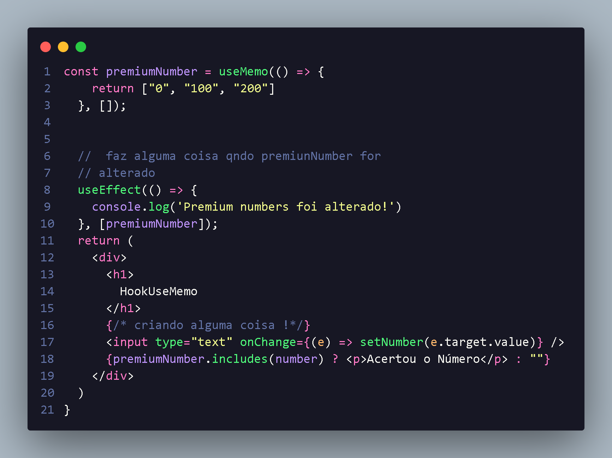

<h1 align="center"> Introdução UseMemo </h1>

  O useMemo pode ser utilizado para garantir a referência de um objeto!
  Fazendo com que algo possa ser atrelado a uma referência e não a um valor,Com isso conseguimos condificonar useEffects a uma variavel de maneira mais inteligente!

 
  

  
 no caso acima ele ira dar warnimg !
  

 
  

  

    Para evitar isso utilizamo o useMemo  com ele a gente perdera tempo!
  

 
  
  

