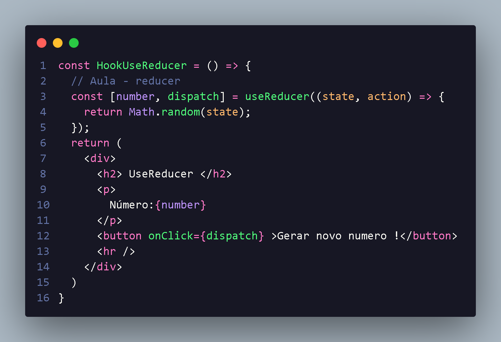
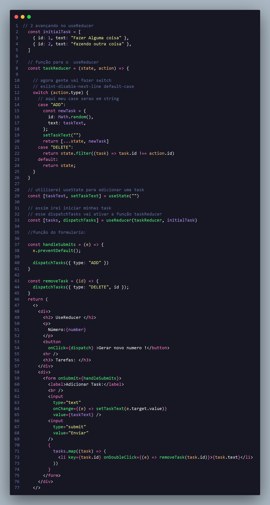

<h1 align="center"> intro sobre UseReducer </h1>

  O useReducer tem a mesma função que o useState,ele gerencia valores:

  <li style="font-size:16px;">Porém temos a possibilidade de executar uma função na hora da alteração do valor:
  <li style="font-size:16px;">
  Então temos que o useReducer recebe um valor para gerenciar e uma função para alterar este valor:

Sintaxe do useReducer : 

      const [
        variavel ,
        dispatch 
      ] = useReducer(
        recebe 2 arguments
        (state,action) => {
         //  o state e o valor da variavel
          return Math.rando(state)
        }

      )

A utilização do dispatch  no useReducer e onde executaremos a função para alterar aqueel valor da variavel,

  <b> UseReducer(state,action) :</b> recebe dois argumentos onde um dele e variavel  onde podemos  modificala e com isso utilizaremos dispatch para acionar esse acontecimento:  

 
Com isso toda vez que clica no button ele vai gerar novo state  baseado naquela função dispatch ! PowerReduce

<h3 align="center"> UseReducer com action </h3>

Se o <b>UseReducer</b> fosse utilizado como no exemplo passado,não teria tanta diferençça do useState:
<li> Por isso o reducer geralmente contpem operações mais complexas,utilizando a estrutura 
switch com actions;
<li>Esta situação foi aprensetada na seção ContextApi:

   
  

