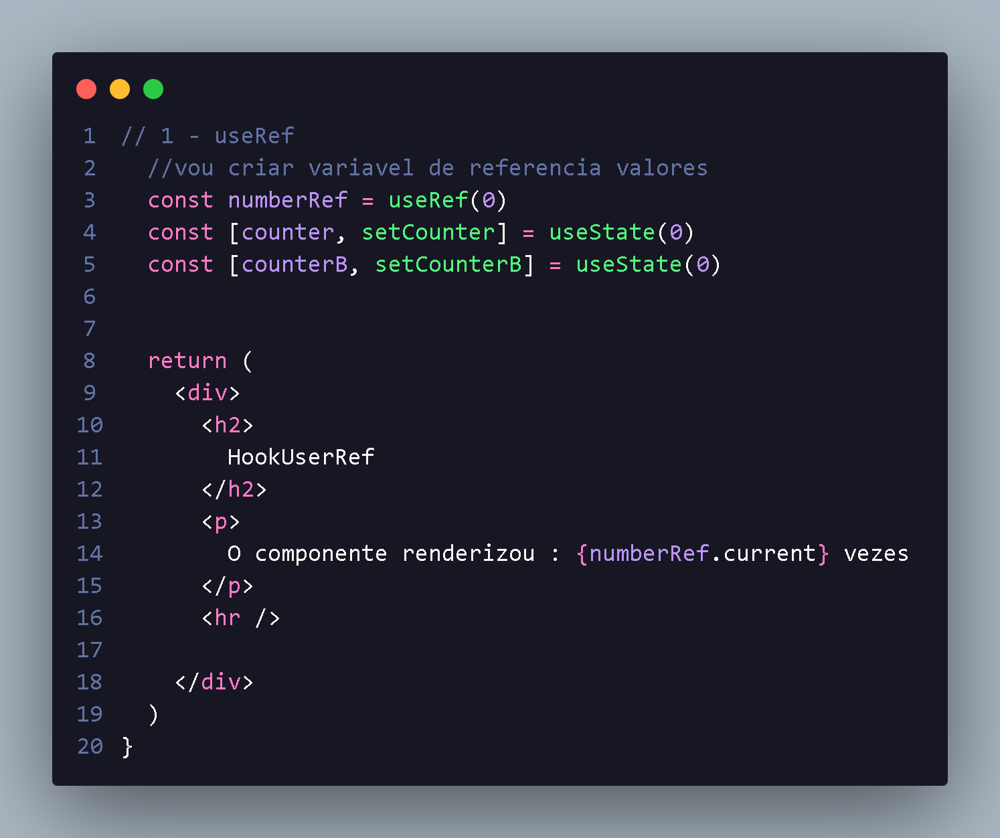
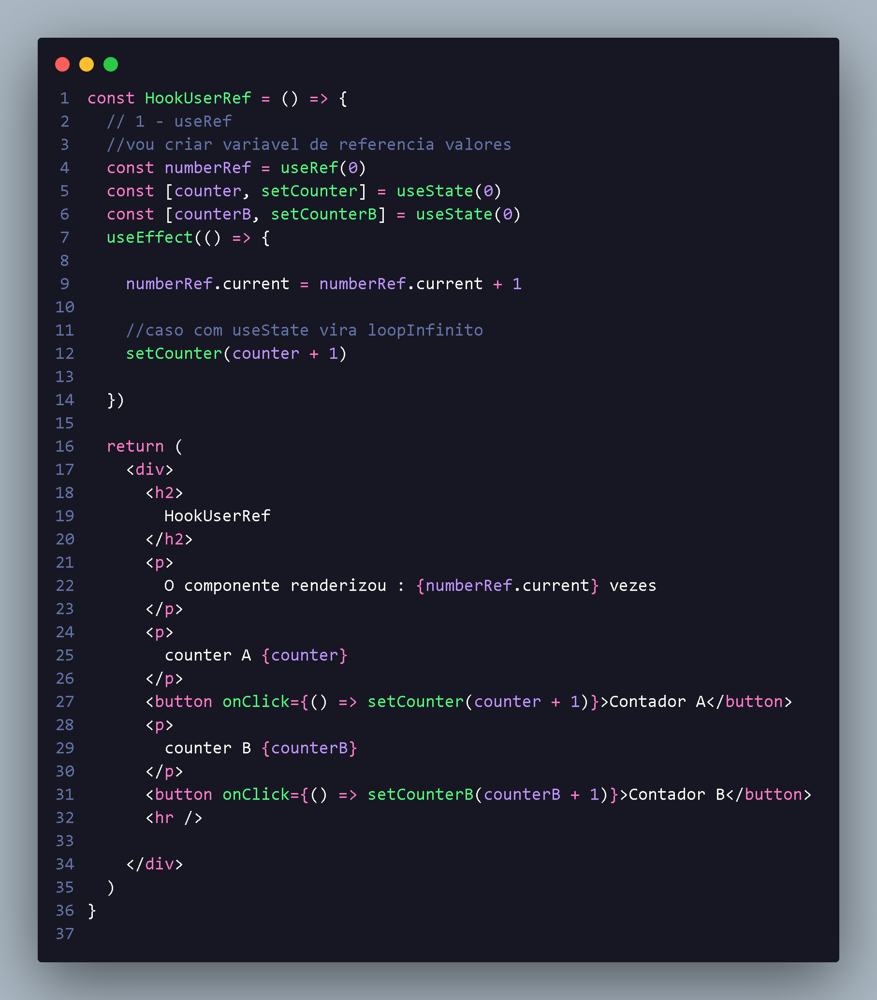
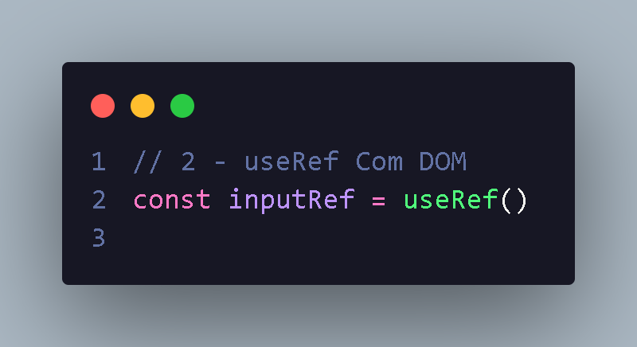
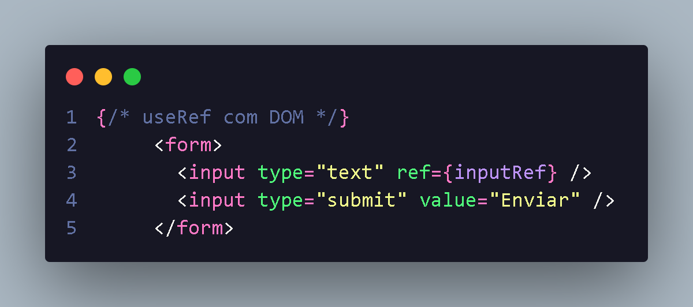
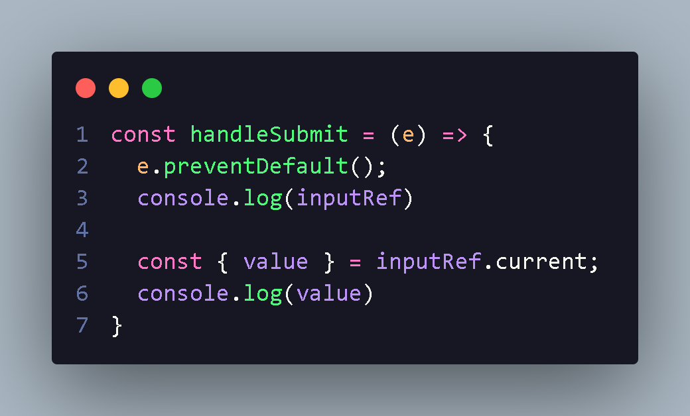
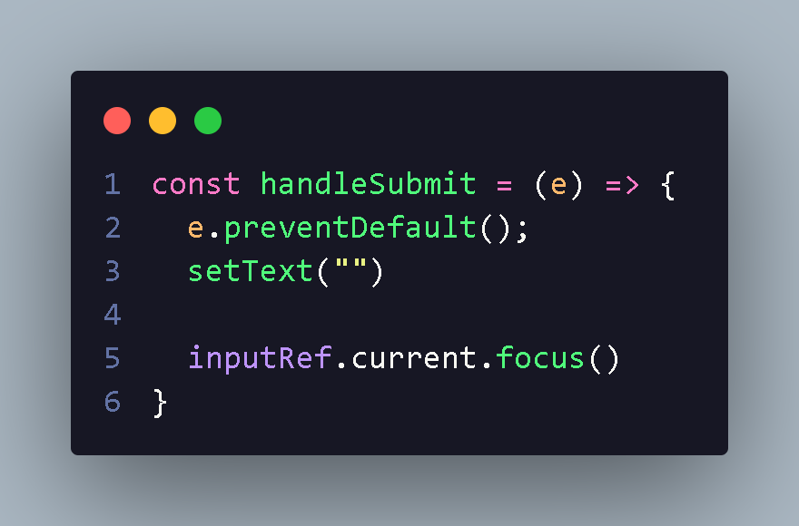

<h1 align="center"> introdução useRef</h1>

O useRef pode ser utilizado como useState para gerenciar valores,a diferença e que ele é um objeto,seu valor está na propriedade current .

<li style="font-size:16px"> Outra particularidade do useRef e que ele não re-renderiza o componente ao ser alterado,sendo interessante alguns casos</li>

    O useRef tem sintaxe diferente onde para utiliza variavel utilizamos current !
  

 
  

  

  Com isso podemos deixa-lo dinamico com utilização dos hook useState e useEffect,
  utilizando useEffect para renderizar,em
  caso useEffect com useState causaria um loop
  infinito,mas como utilizamo useRef ele renderiza por cada ação efetuada!
  

  

<h2 align="center"> UseRef Com DOM</h2>

  

    O useRef pode ser utilizado para selecionar elementos do JSX !
  

  <li style="font-size:16px;">Podemos fazer manipulação de Dom ou aplicar funções focus,que foca no input! um dos uso muito interessante para este hook.
  

   
  
  <li style="font-size:16px;"> Com manipulação de dom  e useRef a geente cria um atributo onde passaremos a variavel do hook ref={inputRef}
   
  

  

   
  <li>
  para obter valores dentro do useRef a gente pode utiliza seguinte maneira utilizando current
  </li>
  

  

  <li> Com isso podemos utilizar metodo como focus(),aonde depois qeu usuario clicar ele vai ter focus no input novamente :

   
  
  

