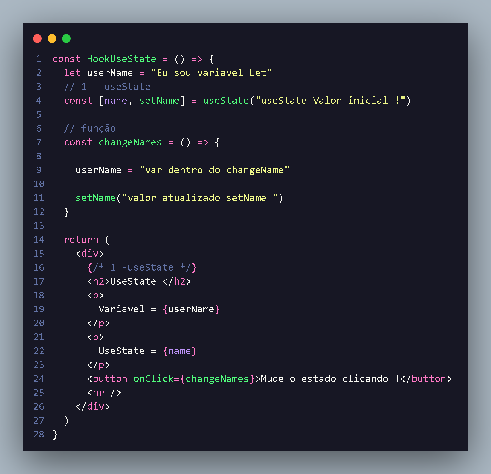
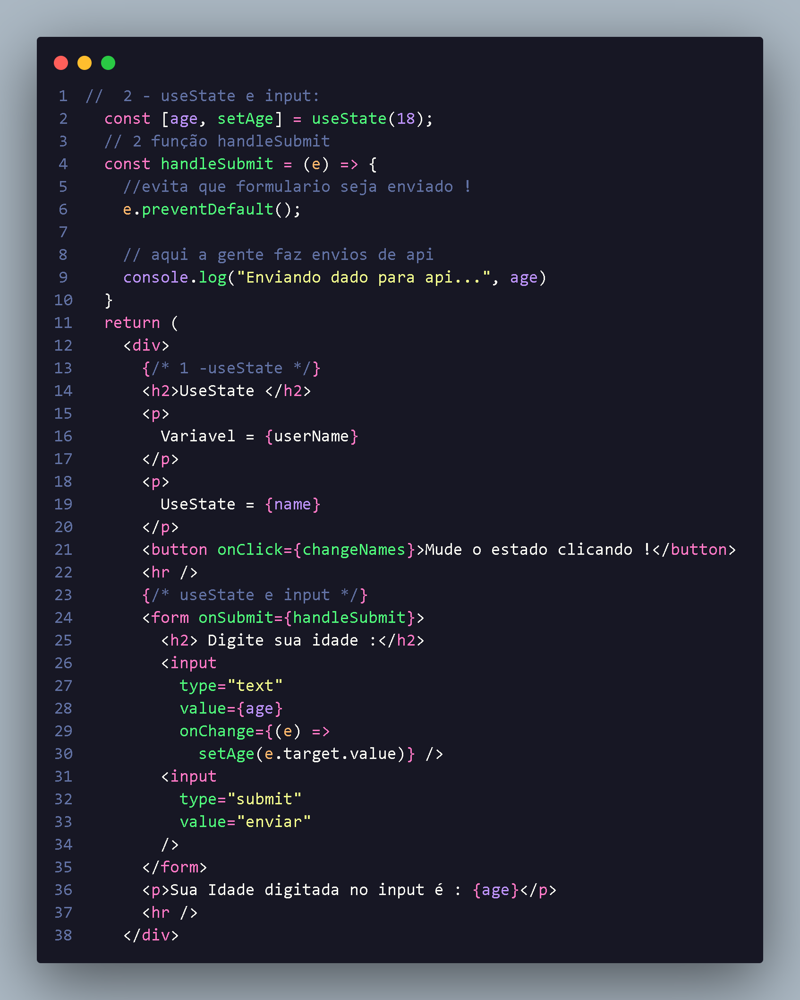

<h1 align="center">UseState</h1>

O useState e um dos principais hooks do React;

<li style="font-size:16px;">
O principal proposito e gerenciar valores;
</li>
<li  style="font-size:16px;">
Podemos consultar um valor e alterar;
</li>
<li style="font-size:16px;">
Isso nos permite re-renderizar um componente, oque não acontece com a manipulação de variaveis.
</li>
<li  style="font-size:16px;">
    Utilizando useState a sintaze dela e simples a gente vai fazer destruturação de array  onde gente passa variavel e setVariavel ,onde setVariavel será responsavel por atualizar variavel.

    
 
     
     const [
      consulta do valor,
      metodo que a gente atualiza
     ] = useState(
      podemos adicionar valor inicial
     )
</li>
<h4 style="font-size:16px;"> 
    Exemplo de como e utilizado : 
    

</h4>

  
  
 
   
    Com isso a varaivel userName não pode renderizar quando a gente clicar com botao ,ja hook useState ele automaticamente muda e ja renderiza ! PowerHook
  

  <h2 align="center"> UseState E Inputs </h2> 
  

    Atrelando useState a um input podemos fazer algumas ações: 
  
  <li style="font-size:16px;"> Alterar de um state por eventos de onChange;
  <li style="font-size:16px;">Limpeza de input( Controlled input )
  <li style="font-size:16px;">Após preenchimento total do form,unir os state e fazer um envio dos dados p/ back-end
  

  

  

   
  a gente utiliza onSubmit para gerar uma função onde recebera dados state inicial
  e enviaremos para api do backend,
  

