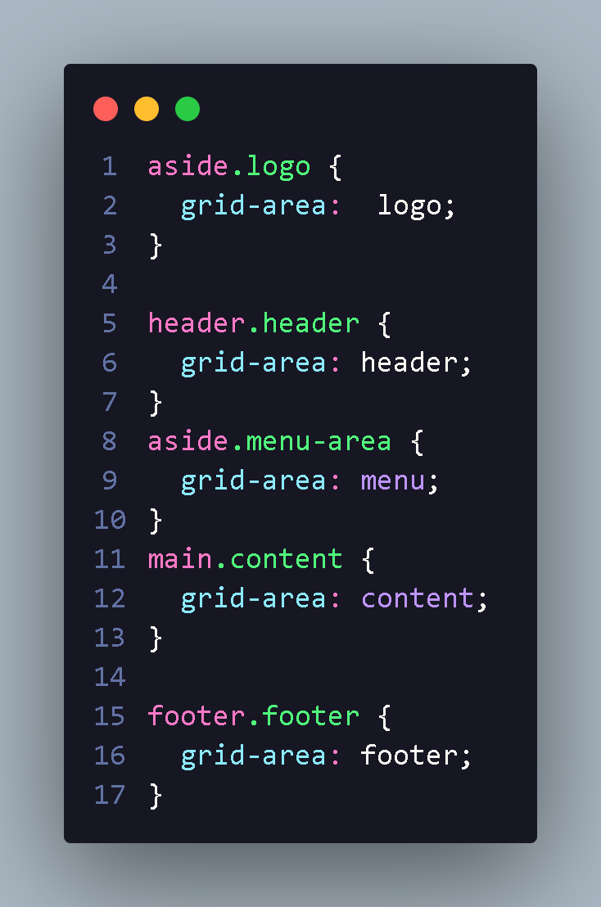

<h1> Estilizadação anotação </h1>

  utilizamos grid area da seguinte maneira

no grid-template-areas fica responsavel por dizer onte cada className ficara  e a orden;
 
Com isso e so escolher e passa nas grid area :

